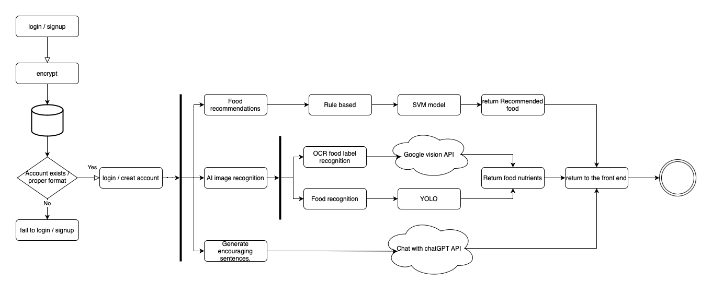
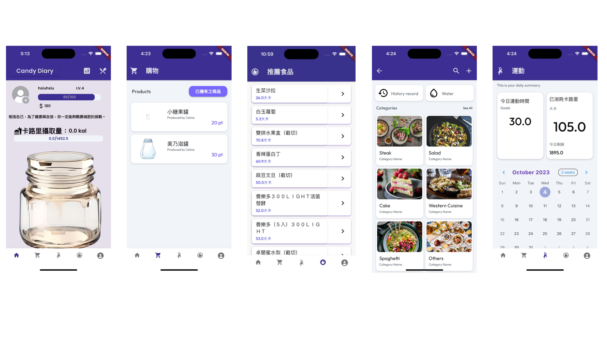

# 🍭 Candy Diary – 自動化食品暨標籤影像辨識記錄系統

**Candy Diary** 是一款整合型減重與健康管理系統，透過影像辨識技術自動記錄食品與標籤資訊，並結合飲食紀錄、運動追蹤、熱量計算、減重建議與回饋制度等功能，提供使用者一站式健康管理體驗。

> 📱 支援 Android / iOS 雙平台  
> 📸 自動拍照辨識食品與標籤  
> 💡 結合 GPT 生成每日鼓勵語，提升使用者黏著度

---

## 🔧 Features / 系統功能

- 📷 **影像辨識紀錄**：  
  利用 YOLOv5 進行食品與標籤偵測，自動記錄飲食內容與食材

- 🔤 **文字辨識（OCR）**：  
  採用 Google Cloud Vision API 執行食品標籤上的文字辨識（各項營養指標數值）

- 🥗 **每日飲食管理**：  
  建立個人化飲食資料庫，記錄每餐攝取內容與卡路里

- 🏃‍♂️ **運動記錄與熱量換算**：  
  提供多種運動類型與時間輸入，計算消耗熱量

- 📊 **減重法建議與報告**：  
  依據使用者目標與資料推送五種減重建議，並提供體重變化報告

- 🎮 **成就制度與商城化界面**：  
  建立經驗值與金幣系統，並能購買個人化 UI 主題

---

## 🖼️ System Architecture / 系統架構

---

## 🛠️ 技術技術

- YOLOv5 – 食品物件偵測  
- Google Cloud Vision API – OCR 辨識  
- GPT – 生成文字人機互動  
- Flutter + Flutter Flow – 跨平台前端開發  
- PostgreSQL – 後端資料管理  
- OpenCV – 影像前處理

---

## 🖼️ 展示畫面（Demo Screenshots）

## APP介紹影片

